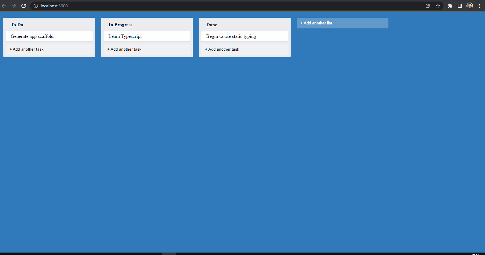

<h1 align="center">
  
   
  Simple Trello
</h1>

<h3 align="justify">
Didactic application of a drag and drop Trello application using ReactJS and the TypeScript super set. The concepts of Componentization and hooks were used. Credits for the FullStack React with TypeScript - Learn Pro Patterns for Hooks, testing, Redux, SSR and GraphQl course Chapter 1 challenge - Maksim Ivanov and Alex Bespoyasov.
</h3>
 

## 📷 Demonstration

<h4 align="left"></h4>
  

 

## 🚀 Technologies

This project was developed with the following technologies:

- [TypeScript](https://www.typescriptlang.org/docs/)
- [ReactJS](https://reactjs.org/)
- [Reducer](https://redux.js.org/tutorials/fundamentals/part-3-state-actions-reducers)
- [React DND](https://react-dnd.github.io/react-dnd/)
- [HOC](https://pt-br.reactjs.org/docs/higher-order-components.html)

 

## ⚙ Commands Running locally Client
- npm start

## ⚙ Documentatios
- <a href=".github/Documentation.pdf">PDF</a>

Made with 💜 by Rafael Maciel
